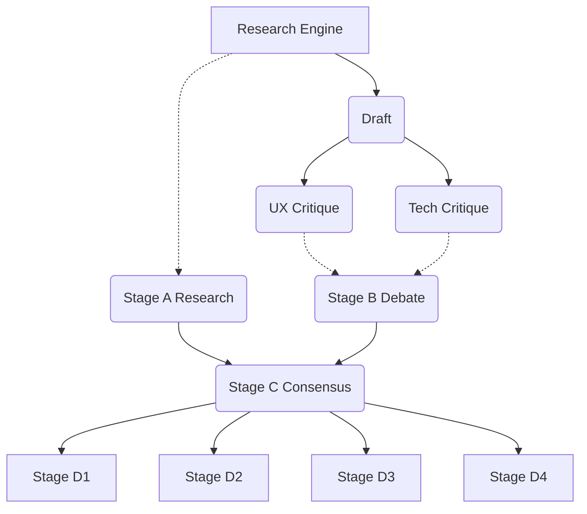

# Parallelization Report

## Dependency Graph

## Safe Concurrency Execution
The following LLM calls have strictly independent inputs and can safely execute concurrently using `Promise.all()`:

1. **Critique Parallelization**: `UX Critique` and `Tech Critique` both depend solely on `Draft`. They can run concurrently.
2. **Summary Parallelization**: `Stage A (Research Summary)` depends solely on `Research Report`. `Stage B (Debate Summary)` depends solely on `Draft` and the critiques. They can run concurrently.
3. **Hierarchical Stage Parallelization**: `Stage D1`, `Stage D2`, `Stage D3`, and `Stage D4` all depend solely on `Stage C Consensus Summary`. They can run concurrently.

## Expected Savings
- **Critique Phase**: ~150s saved (whichever is faster is completely absorbed).
- **Hierarchical Phase**: ~200s saved (running 4 stages concurrently means total time = `max(D1, D2, D3, D4)` instead of `sum(D1, D2, D3, D4)`).
- **Total Latency Reduction**: ~350s (6 minutes) per project on environments that support concurrent inference requests (e.g., vLLM, TensorRT, or Ollama with sufficient VRAM). *Note: CPU-bound Ollama queues concurrent requests sequentially, so actual local savings will be zero, but architectural limits are removed.*
